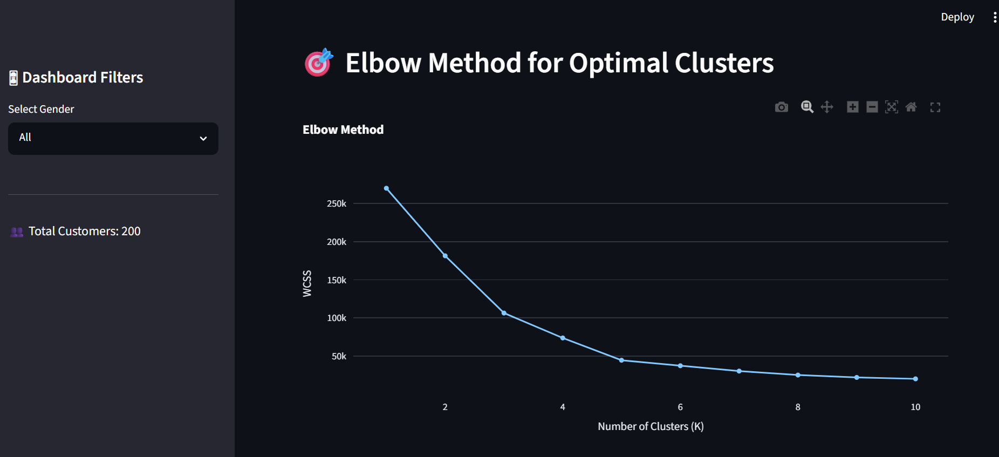
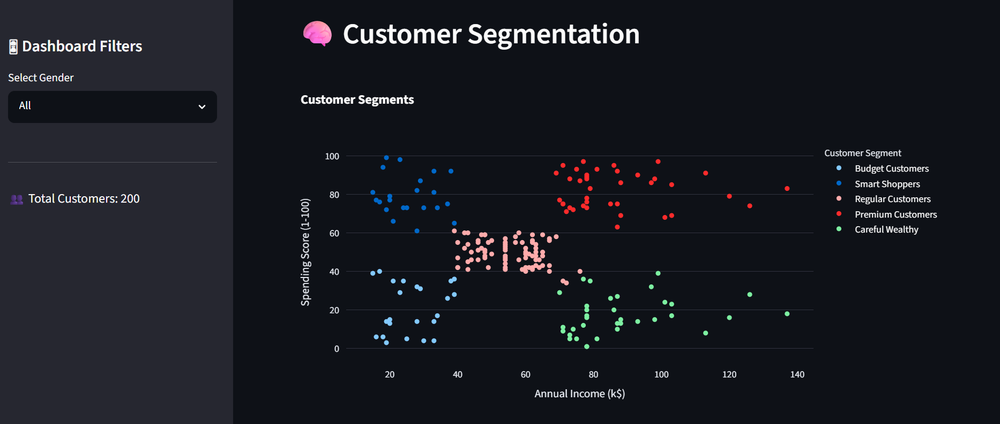
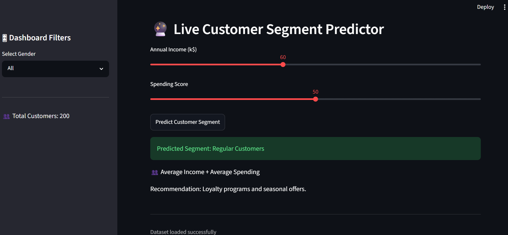
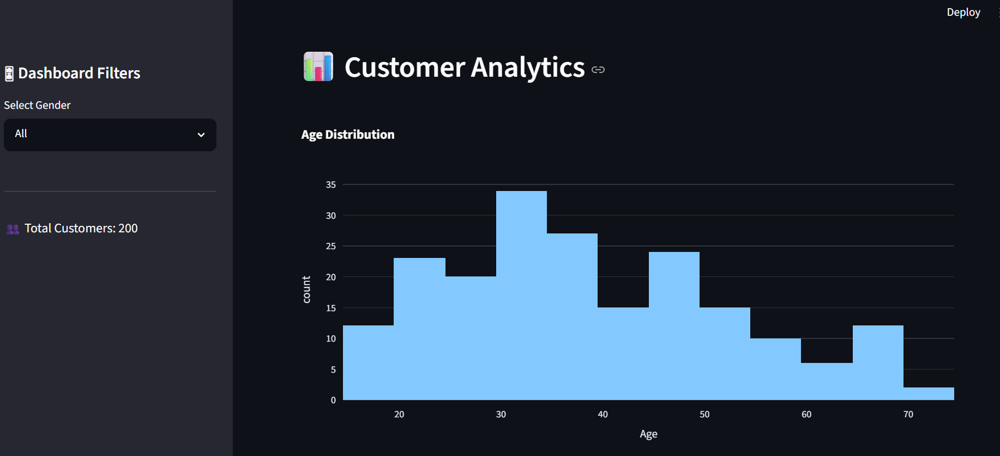
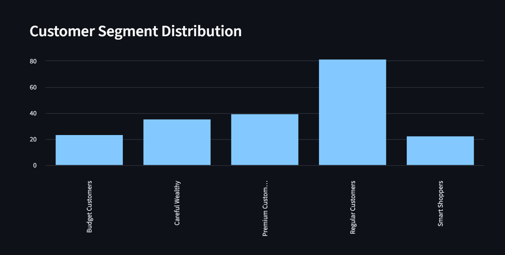

# 🛍 Smart Retail Customer Analytics Dashboard

An interactive Machine Learning dashboard that segments retail customers using **K-Means Clustering** and provides actionable business insights for targeted marketing and customer retention strategies.

---

## 📌 Project Overview

Retail businesses often struggle to understand customer purchasing behavior and identify valuable customer groups.

This project applies **K-Means Clustering** on the Mall Customers Dataset to automatically segment customers based on:

* Annual Income
* Spending Score

The results are visualized through an interactive Streamlit dashboard that helps businesses understand customer behavior and design data-driven marketing campaigns.

---

## 🚀 Features

### 📊 Customer Analytics

* Customer dataset preview
* Dataset statistics and information
* Age distribution analysis
* Income distribution analysis
* Spending score distribution
* Gender distribution visualization

### 🎯 Elbow Method

* Calculates WCSS (Within Cluster Sum of Squares)
* Identifies the optimal number of clusters
* Interactive visualization using Plotly

### 🧠 Customer Segmentation

* K-Means clustering implementation
* Interactive customer segment visualization
* Cluster distribution analysis
* Cluster center visualization
* Silhouette Score evaluation

### 🔮 Live Customer Segment Predictor

Predict customer segments in real-time using:

* Annual Income
* Spending Score

### 📥 Export Results

* Download customer segmentation results as CSV

* 
Source:
https://www.kaggle.com/datasets/vjchoudhary7/customer-segmentation-tutorial-in-python


---

## 🤖 Machine Learning Workflow

1. Data Collection
2. Data Exploration
3. Feature Selection
4. Elbow Method Analysis
5. K-Means Clustering
6. Cluster Evaluation using Silhouette Score
7. Customer Segmentation
8. Business Insights Generation

---

## 📂 Project Structure

```text
SCT_ML_02/
│
├── data/
│   └── Mall_Customers.csv
│
├── images/
│   ├── Homepage.png
│   ├── Cluster_summary.png
│   ├── Customer_analytics.png
│   └── Customer_distribution.png
    └── Customer_segmentation.png
    └── elbow_method.png
    └── Live_predictor.png
│
├── app.py
├── requirements.txt
├── README.md
└── .gitignore
```

---

## 🛠 Technologies Used

* Python
* Streamlit
* Pandas
* Plotly
* Scikit-Learn
* NumPy

---

## 📈 Clustering Features

### Features Used for Clustering

* Annual Income (k$)
* Spending Score (1–100)

### Algorithm

* K-Means Clustering

### Evaluation Metric

* Silhouette Score

---

## 📸 Dashboard Screenshots

### Elbow Method



### Customer Segmentation



### Live Predictor




## Customer Analytics



## Customer Distribution



---

## 💼 Business Impact

This dashboard can help businesses:

* Identify high-value customers
* Improve customer retention
* Personalize marketing campaigns
* Optimize promotional strategies
* Increase customer engagement
* Support data-driven decision making

---

## ▶️ Installation

Clone the repository:
```bash
git clone https://github.com/rashmideepaktoragallamath/SCT_ML_02.git
```
Navigate to the project directory:

```bash
cd SCT_ML_02
```

Install dependencies:

```bash
pip install -r requirements.txt
```

Run the application:

```bash
streamlit run app.py
```

---

## 📊 Dataset

Mall Customer Dataset containing:

* CustomerID
* Gender
* Age
* Annual Income (k$)
* Spending Score (1-100)

---

## 🔮 Future Improvements

* Dynamic Cluster Selection
* RFM Analysis
* Customer Lifetime Value Prediction
* Model Persistence
* Advanced Customer Recommendation System

---

## 👨‍💻 Author

**Rashmi Deepak Toragallamath**

Machine Learning & Data Science Enthusiast
